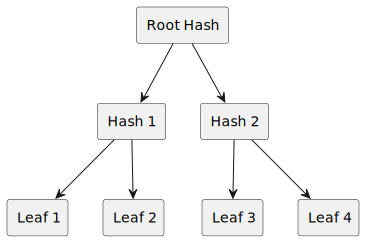

# How Merkle Proofs work.

Merkle proofs hinge on a data structure called a **Merkle Tree**, built by hashing paired data (leaves) together in ascension to eventually create a unique **Merkle Root**.



This Merkle Root serves as a unique identifier for the entire collection of leaves (and their pair hashes). The hierarchical structure ensures data integrity as any elements not in the original leaf layer would lead to a different root.

**Merkle proofs** offer a secure method to confirm the presence of specific leaves from the root, without exposing any unnecessary data.

### Why use Merkle Proofs

**Merkle Proofs** enhance privacy. Simply put, they enable the independent verification of a specific inclusion assertion. This distinct advantage assures data holders of their privacy while ensuring the integrity of individual transactions.

In instances of vast datasets, employing Merkle trees reduces computational resources needed for verification. By eliminating the need to possess the entire set of leaves for verification, data digest becomes more manageable, easing constraints on resources without sacrificing on security.

## Anatomy of a Merkle Tree.

The lowest layer consists your singular data elements. The leaves. (In blockchains these could be block **transactions**.) These are hashed in pairs to generate the next level of the tree.

```
@startuml treeDiagram
rectangle "Root Hash" as root
rectangle "Hash 1" as hash1
rectangle "Hash 2" as hash2
rectangle "Leaf 1" as leaf1
rectangle "Leaf 2" as leaf2
rectangle "Leaf 3" as leaf3
rectangle "Leaf 4" as leaf4

root --> hash1
root --> hash2
hash1 --> leaf1
hash1 --> leaf2
hash2 --> leaf3
hash2 --> leaf4
@enduml
```

Using the respective hashes and sibling hashes from the levels above your transaction, one can create a path leading up to the Merkle Root. With the correct hashes, anyone running the proof can independently recreate the pathway leading up to the Merkle Root, confirming transactions’ existence within a block.

When individual leaves are verified, they construct a fragment of the Merkle tree pathway leading to the root. Through this, users are able to cross-check with the known Merkle root of their fragment against the actual Merkle root of the entire data set.

This system promotes fast and efficient verification, and allows for the visibility of data manipulation. Since modifying any piece of data - the addition, removal, or alteration of a leaf - results in a new calculation path, it inevitably creates an entirely different Merkle Root.

Consequently, Merkle proofs make it possible to discover both what and which sections of data have been tampered with.


Let’s explore how Merkle Proofs work using an example for a whitelisting of three email addresses.

## What are we building?
As part of this tutorial, let's build an email addrees whitelisting app using a typescript library (**merkle-patricia-tree**). If an email address belongs to a known secure and hashed dataset or top level domain, and we possess the Merkle root of said set, then it gets whitelisted when it can be traced from the root. Else, we flag possible suspicious email address. This too shall be displayed by testing for an email we know is not in the dataset.


### Prerequisites
We'll assume that you are familiar with TypeScript (JavaScript), React, and have node.js and npm installed.

### Step 1: Setting Up Your Project
First, create a new directory for your project and initialize a Node.js project using npm:

```
mkdir merkle-proof-demo
cd merkle-proof-demo
npm init -y
npm install ethereumjs-util merkletreejs
npm install @types/node --save-dev

```
Install the merkle-patricia-tree library:

```
npm install merkle-patricia-tree
```

### Step 2: Implementing the Merkle Tree
Create a TypeScript file (e.g., merkleProofDemo.ts) and write the following code:

```
import MerkleTree from 'merkletreejs';
import * as ethUtil from 'ethereumjs-util';

// Define the email addresses for whitelisting
const emailAddresses = [
  'alice@example.com',
  'bob@example.com',
  'charlie@example.com',
];

// Function to hash an email address
function hashEmail(email: string): string {
  const buffer = ethUtil.toBuffer(email);
  return ethUtil.bufferToHex(ethUtil.keccak(buffer));
}

// Create an array of hashed email addresses
const hashedEmails = emailAddresses.map((email) => hashEmail(email));

// Create a Merkle Tree from the hashed email addresses
const merkleTree = new MerkleTree(hashedEmails, ethUtil.keccak, {
  sortPairs: true,
});

// Email address to prove
const emailToProve = 'alice@example.com';

// Hash the email to prove
const emailToProveHash = hashEmail(emailToProve);

// Generate a Merkle Proof for the email
const proof = merkleTree.getProof(emailToProveHash);

// Display the Merkle Proof
console.log('Merkle Proof for', emailToProve);
console.log(proof);
```

### Step 3: Running the Code
Save the file and run the TypeScript code:

```
npx ts-node merkleProofDemo.ts
```
The code above does the following:

1. Defines the email addresses for whitelisting and a function to hash email addresses using ethereumjs-util.
2. Creates an array of hashed email addresses.
3. Creates a Merkle Tree from the hashed email addresses using merkletreejs.
4. Specifies the email address ("alice@example.com") to prove and calculates its hash.
5. Generates a Merkle Proof for the specified email address.
6. Displays the generated Merkle Proof.

Running the file should return the following in terminal:

```
Merkle Proof for alice@example.com
[
  {
    position: 'right',
    data: <Buffer 83 de a3 8d 99 2d 83 2d 71 55 7c 84 5c e8 61 39 12 f7 0d e6 90 a7 9d f7 4a c8 db fa 91 aa ba 53>
  },
  {
    position: 'right',
    data: <Buffer c6 98 d6 7f 73 13 33 b4 41 ef 6e 69 f1 34 93 bc b3 bd 0c 75 17 4d 04 f9 0e 05 96 64 83 a9 20 fa>
  }
]
```

**Fun check:** Change the emailToProve variable and you will not get the proof.  